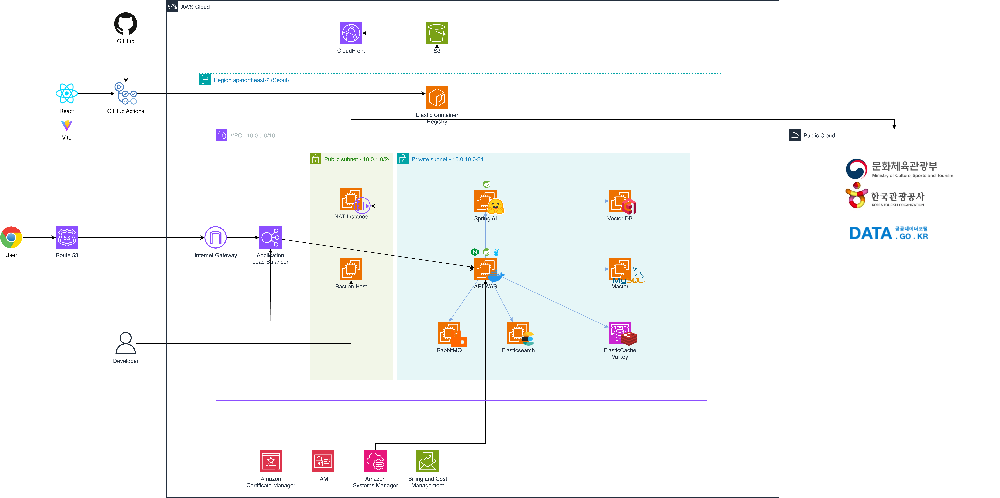
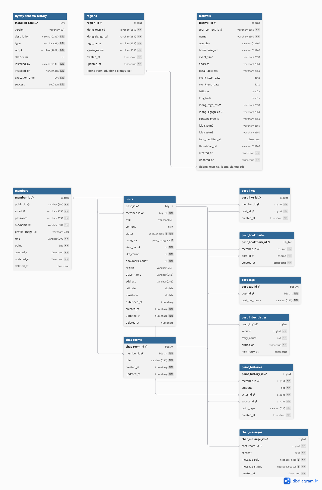

<div align="center">

## 📈 여정

**여**행 **정**보를 공유하는 곳

[https://www.yeojung.life](https://www.yeojung.life)
[](https://www.yeojung.life)

</div>

- 여정은 가고 싶은 장소, 다녀온 여행지, 축제 정보를 공유하는 여행 정보 플랫폼입니다.

---

### 🎬 시연 영상

▶ *(시연 영상 링크 추가 예정)*

---

### 📌 목차

- [프로젝트 소개](#-프로젝트-소개)
- [주요 기능](#-주요-기능)
- [아키텍처](#-아키텍처)
- [DB ERD](#-db-erd)
- [기술 스택](#-기술-스택)
- [폴더 구조](#-폴더-구조)
- [배포](#-배포)
- [기술적 의사결정](#-기술적-의사결정)
- [팀 소개](#-팀-소개)

---

### 🎯 프로젝트 소개

여정은 여행지, 맛집, 숙소, 축제 등 여가 정보를 공유하는 플랫폼입니다.
한국관광공사 TourAPI로 국내 축제를 캘린더에서 확인하고 상세 페이지로 이동할 수 있으며,
카나나(Kanana) 모델 기반 AI 챗봇으로 게시글, 축제, 여행 정보를 대화형으로 얻을 수 있습니다.


1. **전문 검색, 자동완성**
   MySQL이 약한 한글 전문 검색, 부분입력 자동완성을 Elasticsearch(nori 분석기)로 분리하고, ES는 매칭만·표시 데이터는 RDB가 채우는(hydration) 구조로 정합성 부담을 줄였습니다. 색인은 더티 테이블 기반 증분 배치로 비동기 반영합니다.

2. **비동기 이벤트 파이프라인**
   게시, 좋아요, 북마크 시 작성자에게 여정 포인트를 적립하는 로직을 Spring 이벤트 → RabbitMQ 2단으로 분리해, 도메인 행위와 부가 처리를 느슨하게 결합하고 멱등 적립으로 중복을 방지했습니다.

3. **포인트 적립 정책**
   유실률이 높은 조회수는 퀄리티 스코어에서 제외하고, 게시, 좋아요, 북마크를 받은 경우에만 포인트를 적립하도록 설계했습니다. 본인 글에 스스로 좋아요, 북마크해서 포인트를 얻는 어뷰징은 정책적으로 차단했습니다.

4. **외부 API 연동 배치**
   한국관광공사 TourAPI를 연동해 축제 정보를 주기적으로 동기화하고, 일일 호출, 네트워크 실패를 고려한 재시도, 트랜잭션 경계 전략을 설계했습니다.

5. **이미지와 데이터 수명주기**
   이미지는 S3 Presigned URL로 서버를 거치지 않고 업로드하고 CloudFront로 서빙하며, 미참조 이미지, 탈퇴 회원 데이터는 배치로 정리해 고아 데이터가 쌓이지 않도록 했습니다.

6. **무중단 배포와 클라우드 인프라**
   VPC(퍼블릭/프라이빗) 위에서 ALB(ACM TLS 종단) → nginx → blue/green 구조로 무중단 배포하고, OIDC 인증, SSM 기반 배포로 시크릿이 CI/CD 파이프라인을 거치지 않도록 구성했습니다.

---

### ✨ 주요 기능

| 구분 | 주요 기능 | 설명                                                            |
|------|-----------|---------------------------------------------------------------|
| 인증 | 로그인 / 로그아웃 / 재발급 | JWT 기반(Access/Refresh 로테이션), Redis 토큰 저장소, 세션 무효화 버전으로 즉시 무효화 |
| 회원 | 가입 / 프로필 / 비밀번호 변경 / 탈퇴 | 이메일 정규화·중복검사, 비밀번호 변경 시 타 세션 무효화, 탈퇴 시 연관 데이터 정리              |
| 게시글 | 작성 / 수정 / 삭제 / 조회 | 즉시 생성 + 임시저장 + 게시, 커서 기반 둘러보기, 메인 피드, 상세 소프트 삭제               |
| 좋아요 / 북마크 | 토글 / 내 목록 | 원자적 `@Modifying` UPDATE로 비정규화 카운트 정합성 확보                      |
| 태그 | 게시글 태그(1:N) | 모든 목록 카드 노출, 어셈블러로 분리해서 병합                                    |
| 검색 | 전문 검색 / 자동완성 | Elasticsearch(nori), `bool_prefix` 부분입력 자동완성, RDB hydration   |
| 여가 포인트 | 적립 | 도메인 이벤트 → RabbitMQ 비동기, 멱등 적립(INSERT IGNORE)                  |
| 축제 | 캘린더 조회 / 연동 배치 | TourAPI 동기화 배치, 월별/일별/다가오는 조회                                 |
| 이미지 | 업로드 / 조회 / 정리 | S3 Presigned 업로드, CloudFront 서빙, 고아 청소 배치                     |

---

### 🏗 아키텍처



---

### 🗂 DB ERD



---

### 💻 기술 스택

### 🌕 Frontend


### 🌑 Backend


-0.12.6-000000?style=flat&logo=jsonwebtokens&logoColor=white)


### 🌒 Database


-7-DC382D?style=flat&logo=redis&logoColor=white)


### 🌟 Messaging / Search


### 🌗 ML


### 🌓 Infra


### 🚀 CI/CD


### 🌓 Build / Library


### ⭐ Tools


### 🌌 Collaboration


### 🌠 Productivity


### 🔭 Observability


---

### 📂 폴더 구조

```text
leisure/
├── src/main/java/com/leisure/
│   ├── member/
│   ├── auth/
│   ├── post/
│   ├── postlike/
│   ├── bookmark/
│   ├── tag/
│   ├── search/
│   ├── pointhistory/
│   ├── festival/
│   ├── region/
│   ├── image/
│   └── global/
│       ├── auth/
│       ├── config/
│       ├── event/
│       ├── exception/
│       └── external/
│
├── src/main/resources/db/migration/
├── docker/
└── .github/workflows/
```

---

### 📦 배포

#### 블루그린 무중단 배포 (EC2 컨테이너 + ECR pull)

```text
main push
  → GitHub Actions
  → 이미지 빌드 → Trivy 스캔(HIGH/CRITICAL 게이트)
  → OIDC로 AWS 인증 → ECR push (leisure/backend:<short-sha>)
  → SSM Run Command로 EC2에서 deploy.sh 실행
  → 현재 라이브의 반대 색(blue/green) 기동 → 헬스체크
  → nginx upstream 스왑 + reload(무중단) → 직전 색 stop(빠른 롤백)
```

- **진입점**: ALB(ACM TLS 종단) → nginx(리버스프록시 + 블루그린 스위치) → blue/green API
- **네트워크**: VPC(퍼블릭/프라이빗 서브넷), API는 프라이빗 서브넷, 외부 호출(TourAPI)은 NAT 인스턴스 경유
- **시크릿**: SSM Parameter Store(SecureString)를 EC2 인스턴스 역할로 직접 fetch → 파이프라인, GitHub Secrets 미경유
- **프론트/이미지**: S3 + CloudFront
- **스키마**: Flyway 마이그레이션, prod는 `ddl-auto: validate`

---

### 🧭 기술적 의사결정

<details>
<summary><b>좋아요, 북마크 카운트 정합성: 원자적 UPDATE로 Lost Update 방지</b></summary>

<br>

### 문제 정의
- 빠른 조회를 위해 게시글의 좋아요/북마크/조회 수를 비정규화 컬럼으로 관리합니다.
- 조회 후 값을 변경해 저장하는 방식은 동시 요청 시 두 트랜잭션이 같은 값을 읽고 각각 `+1` 하여 나중 저장분이 먼저 증가분을 덮어쓰는 Lost Update가 발생할 수 있습니다.

### 해결
- 카운터 갱신을 조회-수정-저장 대신 JPA를 우회한 원자적 `@Modifying` UPDATE(`likeCount = likeCount + 1`)로 처리했습니다.
- 증감 쿼리에 `deleted_at is null` + `status = PUBLISHED` 조건을 함께 걸어, 소프트 삭제·비공개 글에는 반영되지 않도록 했습니다.

</details>

<details>
<summary><b>검색: Elasticsearch로 분리하고 RDB가 표시 데이터를 채우는 구조</b></summary>

<br>

### 문제 정의
- 한글 전문 검색, 부분입력 자동완성은 MySQL `LIKE`로는 품질·성능이 부족합니다.
- 반대로 검색 엔진을 원본(source of truth)으로 쓰면 ES, RDB간 정합성 부담이 커집니다.

### 해결
- Elasticsearch(nori 분석기)는 `postId` 매칭, 정렬만 담당하고, 카드/상세 표시 데이터는 RDB가 조회하도록 분리했습니다.
- 색인은 더티 테이블 → 증분 배치 → ES 파이프라인으로 비동기 반영하고, 자동완성은 `bool_prefix`로 구현했습니다.

</details>

<details>
<summary><b>여가 포인트: 도메인 이벤트 + RabbitMQ 비동기 파이프라인</b></summary>

<br>

### 문제 정의
- 게시, 좋아요, 북마크 같은 핵심 행위에 포인트 적립을 동기로 묶으면, 핵심 로직과 부가 로직이 한 흐름에 섞여 단일 책임 원칙(SRP)에 어긋납니다.

### 해결
- 서비스는 도메인 이벤트만 발행하고, `@TransactionalEventListener(AFTER_COMMIT)`가 커밋 후에만 RabbitMQ로 발행해 롤백 시 유령 포인트가 생기지 않도록 했습니다.
- 메시지가 네트워크 문제로 두 번 이상 전달돼도(at-least-once), 적립 시 `INSERT IGNORE`로 이미 적립된 건은 조용히 무시하기 때문에 멱등하게 포인트가 중복으로 쌓이지 않습니다.

</details>

<details>
<summary><b>이미지: S3 Presigned 업로드와 고아 데이터 정리</b></summary>

<br>

### 문제 정의
- 이미지가 애플리케이션 서버를 거치면 대역폭, 메모리 부담이 생기고, 업로드했지만 저장되지 않은(이탈) 이미지가 고아로 쌓입니다.

### 해결
- 백엔드가 서명한 Presigned URL로 브라우저가 S3에 직접 업로드하고, 조회는 CloudFront로 비공개 버킷을 서빙합니다.
- 미참조 + 유예(48h) 경과 객체를 주기 배치로 청소하고, 탈퇴 회원 데이터도 보존 기간(30일) 후 배치로 정리해 고아 데이터가 누적되지 않도록 했습니다.

</details>

---

### 🏠 팀 소개

<table>
  <thead>
    <tr>
      <th style="border: 2px solid black; text-align: center; background-color: #f2f2f2;" colspan="6">여정</th>
    </tr>
  </thead>
  <tbody>
    <tr align="center">
      <td style="border: 2px solid black;">
        <a href="https://github.com/wsh6922" target="_blank">
          
          <br>
          <sub>김남욱</sub>
      </td>
      <td style="border: 2px solid black;">
        <a href="https://github.com/Maneicel" target="_blank">
          
          <br>
          <sub>김윤</sub>  
      </td>
    </tr>
  </tbody>
</table>

---
</content>
